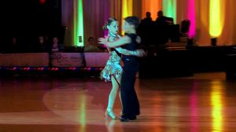
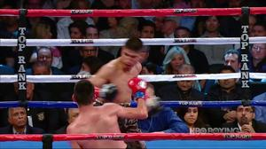
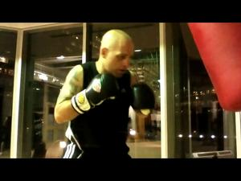
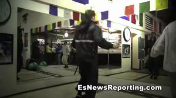
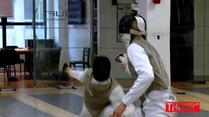
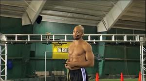

# Subway Surfers Activities Documentation

This model is specialized for the following **6** activities used in game control:

| Activity Name | Game Action | Sample Image |
| :--- | :--- | :--- |
| **ballroom** | **ROLL/DUCK (Down)** |  |
| **boxing, in ring, general** | **MOVE LEFT** |  |
| **boxing, punching bag** | **MOVE LEFT** |  |
| **boxing, sparring** | **MOVE LEFT** |  |
| **fencing** | **MOVE RIGHT** |  |
| **rope skipping, general** | **JUMP (Up)** |  |
