# Detectable Activities Documentation

This model supports **397** activities. Below are sample images for each.

| Activity Name | Sample Image |
| :--- | :--- |
| **Alaska Native Games, Eskimo Olympics, general** | 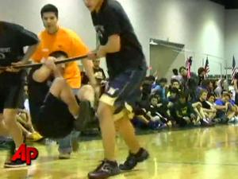 |
| **Anishinaabe Jingle Dancing** | 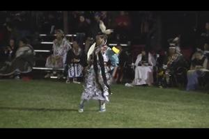 |
| **Caribbean dance (Abakua, Beguine, Bellair, Bongo, Brukin's, Caribbean Quadrills, Dinki Mini, Gere, G** |  |
| **Elliptical trainer, moderate effort** | 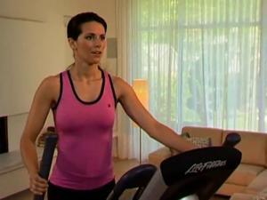 |
| **Irish step dancing** | 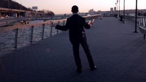 |
| **accordion, sitting** | 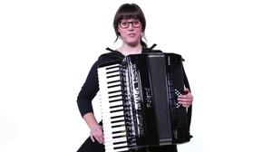 |
| **active workstation, treadmill desk, walking** | 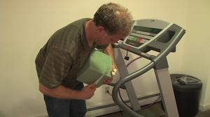 |
| **aerobic, general** | 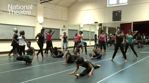 |
| **aerobic, step** | 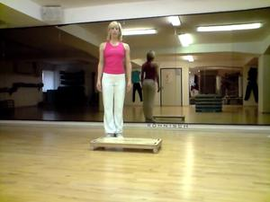 |
| **airline flight attendant** |  |
| **archery, non-hunting** | 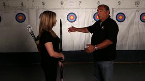 |
| **automobile repair** | 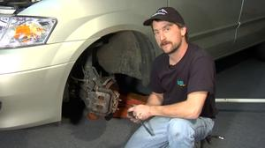 |
| **backpacking** | 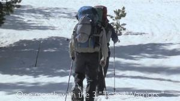 |
| **badminton, competitive (Taylor Code 450)** | 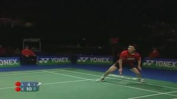 |
| **badminton, social singles and doubles, general** |  |
| **bakery, general** | 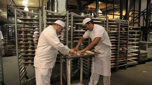 |
| **ballet, modern, or jazz** | 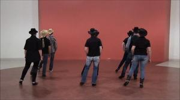 |
| **ballroom** |  |
| **basketball** | 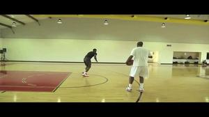 |
| **basketball, game (Taylor Code 490)** | 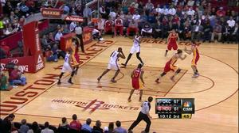 |
| **bicycling, BMX** | 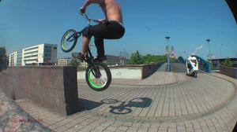 |
| **bicycling, general** | 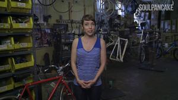 |
| **bicycling, mountain** | 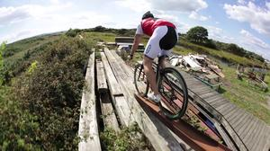 |
| **bicycling, racing and road** | 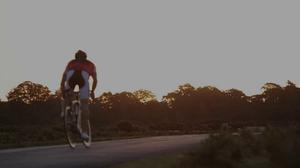 |
| **bicycling, stationary** | 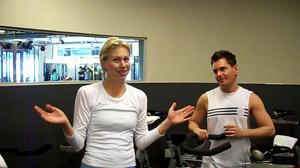 |
| **billiards** | 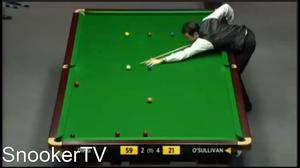 |
| **bird watching, slow walk** | 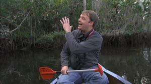 |
| **boating, power** | 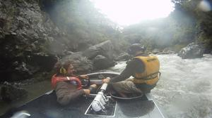 |
| **bookbinding** | 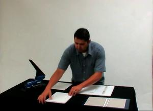 |
| **bowling** | 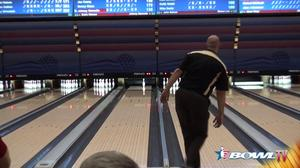 |
| **boxing, in ring, general** |  |
| **boxing, punching bag** |  |
| **boxing, sparring** |  |
| **breastfeeding, sitting or reclining** | 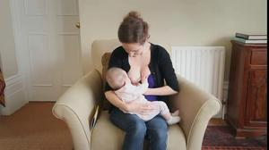 |
| **broomball** | 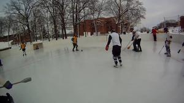 |
| **calisthenics** | 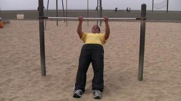 |
| **canoeing, harvesting wild rice, knocking rice off the stalks** | 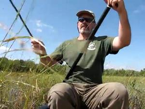 |
| **canoeing, kayaking, rowing, competitive** | 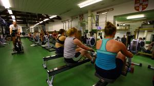 |
| **canoeing, on camping trip (Taylor Code 270)** | 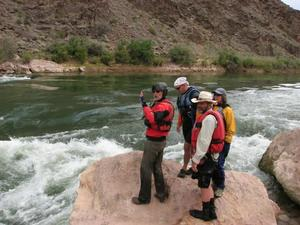 |
| **canoeing, portaging** | 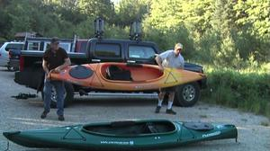 |
| **card playing,sitting** |  |
| **carpentry, finishing or refinishing cabinets or furniture** | 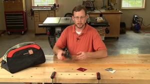 |
| **carpentry, general** | 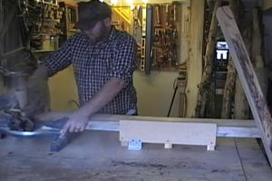 |
| **carpentry, general, workshop (Taylor Code 620)** | 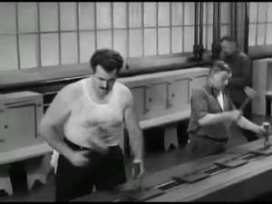 |
| **carpentry, home remodeling tasks** | 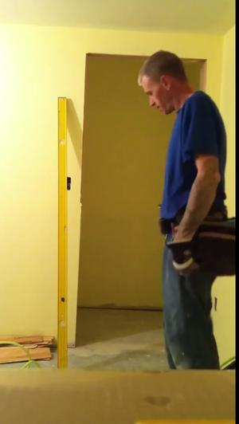 |
| **carpentry, outside house, building a fence** | 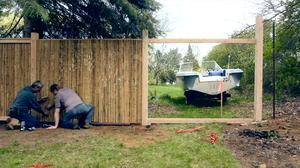 |
| **carpentry, sawing hardwood** | 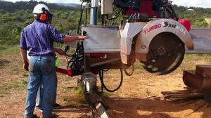 |
| **carrying load, upstairs** | 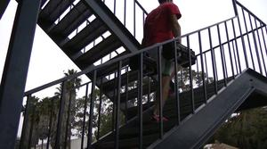 |
| **carrying, loading or stacking wood** | 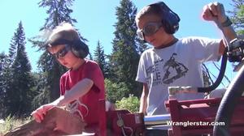 |
| **caulking, chinking log cabin** |  |
| **caulking, except log cabin** | 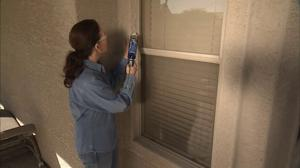 |
| **cello, sitting** | 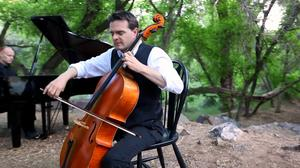 |
| **chambermaid, hotel housekeeper, making bed, cleaning bathroom, pushing cart** | 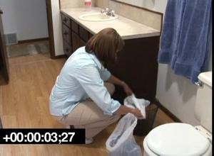 |
| **chess game, sitting** | 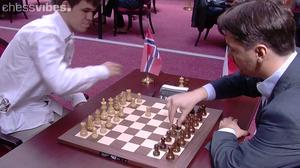 |
| **child care** | 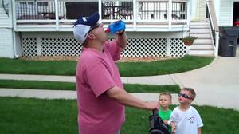 |
| **children_s games, adults playing (e.g., hopscotch, 4-square, dodgeball, playground apparatus, t-ball** | 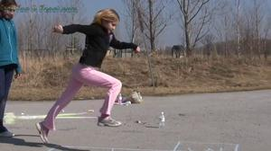 |
| **chopping wood** | 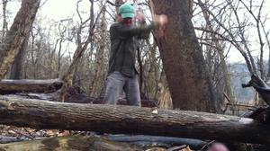 |
| **circuit training** | 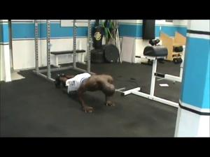 |
| **cleaning gutters** | 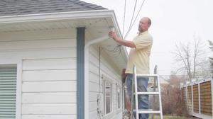 |
| **cleaning windows, washing windows, general** |  |
| **cleaning, general** |  |
| **cleaning, sweeping floor or carpet** |  |
| **clearing brush** |  |
| **climbing hills** |  |
| **coaching** |  |
| **coal mining** |  |
| **conducting orchestra, standing** |  |
| **construction, outside, remodeling, new structures (e.g., roof repair, miscellaneous)** |  |
| **cook, chef** |  |
| **cooking or food preparation** |  |
| **copying documents, standing** |  |
| **cricket, batting, bowling, fielding** |  |
| **croquet** |  |
| **curling** |  |
| **custodial work** |  |
| **cutting and smoking fish, drying fish or meat** |  |
| **darts, wall or lawn** |  |
| **descending stairs** |  |
| **digging sandbox, shoveling sand** |  |
| **digging, spading, filling garden, composting** |  |
| **diving, springboard or platform** |  |
| **dog sledding** |  |
| **double bass, standing** |  |
| **drawing, writing, painting, standing** |  |
| **driving automobile or light truck** |  |
| **driving delivery truck, taxi, shuttle bus, school bus** |  |
| **driving tractor** |  |
| **drumming (e.g., bongo, conga, benbe), moderate, sitting** |  |
| **drums, sitting** |  |
| **dusting or polishing furniture, general** |  |
| **eating, sitting** |  |
| **elder care** |  |
| **engineer (e.g., mechanical or electrical)** |  |
| **ethnic or cultural dancing (e.g., Greek, Middle Eastern, hula, salsa, merengue, bamba y plena, flame** |  |
| **farming** |  |
| **farming, cultivating field** |  |
| **farming, driving tasks (e.g., driving tractor or harvester)** |  |
| **farming, feeding cattle, horses** |  |
| **farming, feeding small animals** |  |
| **farming, milking by hand, cleaning pails, moderate effort** |  |
| **farming, milking by machine, light effort** |  |
| **farming, rice, planting, grain milling activities** |  |
| **farming, taking care of animals (e.g., grooming, brushing, shearing sheep, assisting with birthing,** |  |
| **feeding household animals** |  |
| **felling trees** |  |
| **fencing** |  |
| **fire fighter** |  |
| **fire fighter, hauling hoses on ground, carryinghoisting equipment, breaking down walls etc., wearin** |  |
| **fishing from boat or canoe, sitting** |  |
| **fishing from river bank** |  |
| **fishing in stream, in waders (Taylor Code 670)** |  |
| **fishing with a spear, standing** |  |
| **fishing, catching fish with hands** |  |
| **fishing, commercial** |  |
| **fishing, dip net, setting net and retrieving fish, general** |  |
| **fishing, general** |  |
| **fishing, ice, sitting** |  |
| **fishing, set net, setting net and retrieving fish, general** |  |
| **flute, sitting** |  |
| **food shopping with or without a grocery cart, standing or walking** |  |
| **football or baseball, playing catch** |  |
| **football, competitive** |  |
| **football, touch, flag** |  |
| **forestry** |  |
| **frisbee** |  |
| **garbage collector, walking, dumping bins into truck** |  |
| **gardening with heavy power tools, tilling a garden, chain saw** |  |
| **gardening, general, moderate effort** |  |
| **gardening, using containers, older adults > 60 years** |  |
| **general dancing (e.g., disco, folk, Irish step dancing, line dancing, polka, contra, country)** |  |
| **golf** |  |
| **grooming, washing hands, shaving,brushing teeth, putting on make-up, sitting or standing** |  |
| **guitar, classical, folk, sitting** |  |
| **guitar, rock and roll band, standing** |  |
| **gymnastics, general** |  |
| **hacky sack** |  |
| **hairstyling** |  |
| **hairstylist (e.g., plaiting hair, manicure, make-up artist)** |  |
| **hammering nails** |  |
| **handball** |  |
| **hang gliding** |  |
| **hanging sheet rock inside house** |  |
| **hanging storm windows** |  |
| **health club exerceise classes** |  |
| **high ropes course, multiple elements** |  |
| **hiking** |  |
| **hockey, field** |  |
| **hockey, ice, competitive** |  |
| **hockey, ice, general** |  |
| **home exercise, general** |  |
| **home repair, general** |  |
| **horn, standing** |  |
| **horse cart, driving, standing or sitting** |  |
| **horse grooming, feeding, cleaning, harnessing and unharnessing** |  |
| **horse racing** |  |
| **horseback riding** |  |
| **horseshoe pitching, quoits** |  |
| **hunting, birds** |  |
| **hunting, bow and arrow, or crossbow** |  |
| **hunting, general** |  |
| **hunting, rabbit, squirrel, prairie chick, raccoon, small game (Taylor Code 690)** |  |
| **implied walkingstanding - picking up yard, light, picking flowers or vegetables** |  |
| **ironing** |  |
| **irrigation channels, opening and closing ports** |  |
| **jai alai** |  |
| **jet skiing, driving, in water** |  |
| **jogging** |  |
| **jogging, on a mini-tramp** |  |
| **juggling** |  |
| **kayaking, moderate effort** |  |
| **kickball** |  |
| **kitchen activity, general, (e.g., cooking, washing dishes, cleaning up), moderate effort** |  |
| **kneeling in church or at home, praying** |  |
| **knitting, sewing** |  |
| **lacrosse** |  |
| **landry** |  |
| **laughing, sitting** |  |
| **laundry worker** |  |
| **lawn bowling, bocce ball, outdoor** |  |
| **laying crushed rock** |  |
| **laying or removing carpet** |  |
| **laying tile or linoleum,repairing appliances** |  |
| **loading unloading a car, implied walking** |  |
| **locksmith** |  |
| **lying quietly, sleeping** |  |
| **machine tooling** |  |
| **making bed, changing linens** |  |
| **manager, property** |  |
| **manual or unskilled labor** |  |
| **maple syrupingsugar bushing (including carrying buckets, carrying wood)** |  |
| **marching band** |  |
| **marching, military, no pack** |  |
| **martial arts, different types** |  |
| **masonry, concrete** |  |
| **massage therapist, standing** |  |
| **mopping, standing, light effort** |  |
| **moto-cross, off-road motor sports, all-terrain vehicle, general** |  |
| **motor scooter, motorcycle** |  |
| **moving furniture, household items, carrying boxes** |  |
| **moving household items upstairs, carrying boxes or furniture** |  |
| **moving, carrying or pushing heavy objects, 75 lbs or more, only active time (e.g., desks, moving van** |  |
| **mowing lawn, power mower** |  |
| **mowing lawn, walk, hand mower (Taylor Code 570)** |  |
| **native New Zealander physical activities** |  |
| **non-food shopping, with or without a cart, standing or walking** |  |
| **operating snow blower, walking** |  |
| **orange grove work, picking fruit** |  |
| **organ, sitting** |  |
| **organizing room** |  |
| **orienteering** |  |
| **paddle boarding, standing** |  |
| **paddle boat** |  |
| **paddleball** |  |
| **painting inside house,wallpapering, scraping paint** |  |
| **painting, outside home (Taylor Code 650)** |  |
| **painting,house, furniture, moderate effort** |  |
| **piano, sitting** |  |
| **picking fruits/vegetables** |  |
| **pilates, general** |  |
| **pistol shooting or trap shooting, standing** |  |
| **planting seedlings, shrub, stooping, moderate effort** |  |
| **planting trees** |  |
| **planting, potting, transplanting seedlings or plants, light effort** |  |
| **playing musical instruments, general** |  |
| **playing with animals** |  |
| **playing with children** |  |
| **plumbing activities** |  |
| **police, directing traffic, standing** |  |
| **police, general** |  |
| **police, making an arrest, standing** |  |
| **polishing floors, standing, walking slowly, using electric polishing machine** |  |
| **polo, on horseback** |  |
| **postal carrier, walking to deliver mail** |  |
| **printing, paper industry worker, standing** |  |
| **pulling rickshaw** |  |
| **pushing a wheelchair, non-occupational** |  |
| **pushing car** |  |
| **pushing or pulling stroller with child or walking with children, 2.5 to 3.1 mph** |  |
| **pushing plane in and out of hangar** |  |
| **put on and removal of tarp - sailboat** |  |
| **putting away groceries (e.g. carrying groceries, shopping without a grocery cart), carrying packages** |  |
| **race walking** |  |
| **racking lawn** |  |
| **racquetball** |  |
| **raking roof with snow rake** |  |
| **reading** |  |
| **reclining** |  |
| **repairing appliances** |  |
| **resistance training** |  |
| **riding in a bus or train** |  |
| **riding in a car or truck** |  |
| **riding snow blower** |  |
| **rock climbing** |  |
| **rodeo sports** |  |
| **rollerblading** |  |
| **roofing** |  |
| **rope skipping, general** |  |
| **rowing, stationary** |  |
| **rugby, touch, non-competitive** |  |
| **running** |  |
| **running, cross country** |  |
| **running, marathon** |  |
| **running, on a track, team practice** |  |
| **running, stairs, up** |  |
| **sailing** |  |
| **sailing, in competition** |  |
| **sanding floors with a power sander** |  |
| **scraping and painting sailboat or powerboat** |  |
| **scrubbing floors** |  |
| **serving food and drinks** |  |
| **serving food in church** |  |
| **sharpening tools** |  |
| **shoe repair, general** |  |
| **shoveling dirt or mud** |  |
| **shoveling snow, by hand** |  |
| **shuffleboard** |  |
| **sitting at a sporting event, spectator** |  |
| **sitting in church** |  |
| **sitting meetings, light effort, general, andor with talking involved (e.g., eating at a business me** |  |
| **sitting quietly** |  |
| **sitting tasks, light effort (e.g., office work, chemistry lab work, computer work, light assembly re** |  |
| **sitting, arts and crafts,  carving wood, weaving, spinning wool** |  |
| **sitting, doing work** |  |
| **sitting, in class, general, including note-taking or class discussion** |  |
| **sitting, playing an instrument at church** |  |
| **sitting, playing traditional video game, computer game** |  |
| **sitting, studying, general, including reading andor writing, light effort** |  |
| **sitting, talking in person, on the phone, computer, or text messaging, light effort** |  |
| **sitting, teaching stretching or yoga, or light effort exercise class** |  |
| **sitting, writing, desk work, typing** |  |
| **skateboarding** |  |
| **skating, ice** |  |
| **skating, ice dancing** |  |
| **skating, roller (Taylor Code 360)** |  |
| **skating, speed, competitive** |  |
| **ski jumping** |  |
| **ski machine, general** |  |
| **skiing, climbing up** |  |
| **skiing, cross-country** |  |
| **skiing, cross-country, biathlon, skating technique** |  |
| **skiing, downhill** |  |
| **skiing, general** |  |
| **skiing, water or wakeboarding (Taylor Code 220)** |  |
| **skindiving or SCUBA diving as a frogman, Navy Seal** |  |
| **skindiving, scuba diving, snorkeling** |  |
| **skydiving, base jumping, bungee jumping** |  |
| **sledding, tobogganing, bobsledding, luge (Taylor Code 370)** |  |
| **slide board exercise, general** |  |
| **slimnastics, jazzercise** |  |
| **snorkeling (Taylor Code 310)** |  |
| **snow shoeing** |  |
| **snowboarding** |  |
| **snowmobiling** |  |
| **soccer** |  |
| **softball, general** |  |
| **squash** |  |
| **stair climbing, fast pace** |  |
| **stair climbing, using or climbing up ladder (Taylor Code 030)** |  |
| **standing quietly, standing in a line** |  |
| **standing, arts and crafts, sand painting, carving, weaving** |  |
| **standing, child care, only active periods** |  |
| **standing, doing work** |  |
| **standing, miscellaneous** |  |
| **standing, talking in church** |  |
| **standing, talking in person** |  |
| **steel mill, moderate effort (e.g., fettling, forging, tipping molds)** |  |
| **street skiing** |  |
| **stretching, mild** |  |
| **surfing** |  |
| **sweeping garage, sidewalk or outside of house** |  |
| **swimming, backstroke** |  |
| **swimming, breaststroke, recreational** |  |
| **swimming, butterfly, general** |  |
| **swimming, general** |  |
| **swimming, lake, ocean, river (Taylor Codes 280, 295)** |  |
| **swimming, sidestroke, general** |  |
| **swimming, synchronized** |  |
| **table tennis, ping pong (Taylor Code 410)** |  |
| **tai chi, qi gong, general** |  |
| **tailoring** |  |
| **taking medication, sitting or standing** |  |
| **tanning hides, general** |  |
| **teaching exercise class** |  |
| **tennis** |  |
| **tennis, doubles** |  |
| **tennis, hitting balls, non-game play, moderate effort** |  |
| **therapeutic exercise ball, Fitball exercise** |  |
| **touringtravelingvacation involving riding in a vehicle** |  |
| **touringtravelingvacation involving walking** |  |
| **track and field** |  |
| **trampoline, competitive** |  |
| **trampoline, recreational** |  |
| **trapping game, general** |  |
| **trimming shrubs or trees** |  |
| **trombone, standing** |  |
| **truck driving, loading and unloading truck, tying down load, standing, walking and carrying heavy lo** |  |
| **trumpet, standing** |  |
| **tubing, floating on a river, general** |  |
| **typing, electric, manual or computer** |  |
| **unicycling** |  |
| **upper body exercise, stationary bicycle - Airdyne (arms only) 40 rpm, moderate** |  |
| **using crutches** |  |
| **using heavy tools** |  |
| **vacuuming, general, moderate effort** |  |
| **video exercise workouts, TV conditioning programs** |  |
| **violin, sitting** |  |
| **volleyball, beach, in sand** |  |
| **volleyball, indoor** |  |
| **volleyball, non-competitive** |  |
| **walking the dog** |  |
| **walking, applying fertilizer or seeding a lawn, push applicator** |  |
| **walking, for exerceise, with ski poles** |  |
| **walking, general** |  |
| **walkrun play with children, moderate, only active periods** |  |
| **wallyball, general** |  |
| **wash dishes** |  |
| **washing and waxing car** |  |
| **washing and waxing hull of sailboat or airplane** |  |
| **washing fence, painting fence, moderate effort** |  |
| **water aerobics, water calisthenics** |  |
| **water jogging** |  |
| **water volleyball** |  |
| **water walking** |  |
| **watering lawn or garden, standing or walking** |  |
| **weeding, cultivating garden** |  |
| **weight lifting, power lifting** |  |
| **wheelbarrow, pushing garden cart or wheelbarrow** |  |
| **whitewater rafting, kayaking, or canoeing** |  |
| **windsurfing** |  |
| **windsurfing or kitesurfing, winter** |  |
| **wiring, tapping-splicing** |  |
| **woodwind, sitting** |  |
| **working in scene shop, theater actor, backstage employee** |  |
| **wrestling (one match = 5 minutes)** |  |
| **yard work, general** |  |
| **yoga, Nadisodhana** |  |
| **yoga, Power** |  |
