# Face Detection System - Outstanding Koders

## Overview
This project is a complete Face Detection System built using Python, OpenCV, and Ultralytics YOLOv8. It trains a custom AI model on the WIDER FACE dataset to detect human faces and deploys this model for real-time inference using a system webcam.

**Key Features:**
* **Face Detection:** Detects human faces with high accuracy using a custom trained YOLOv8 model.
* **Hand Gesture Recognition:** Recognizes various hand gestures (e.g., Call, Dislike, Fist, Like, Ok, Peace, Stop, etc.) in real-time.
* **Dual-Model Inference:** Runs two YOLO models in parallel to detect faces and hands simultaneously without conflict.
* **Automated Data Pipeline:** Converts WIDER FACE annotations (pixel coordinates) to YOLOv8 format (normalized).
* **GPU Accelerated Training:** Uses NVIDIA CUDA to train the model efficiently on an RTX 4060.
* **Live Inference:** A real-time camera application that detects and highlights multiple faces and hand gestures instantly.

## Examples

| Face Detection | Call | Dislike | Fist |
| :---: | :---: | :---: | :---: |
|  | 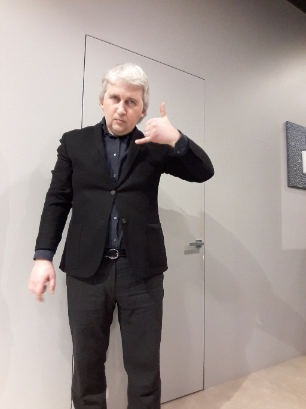 | 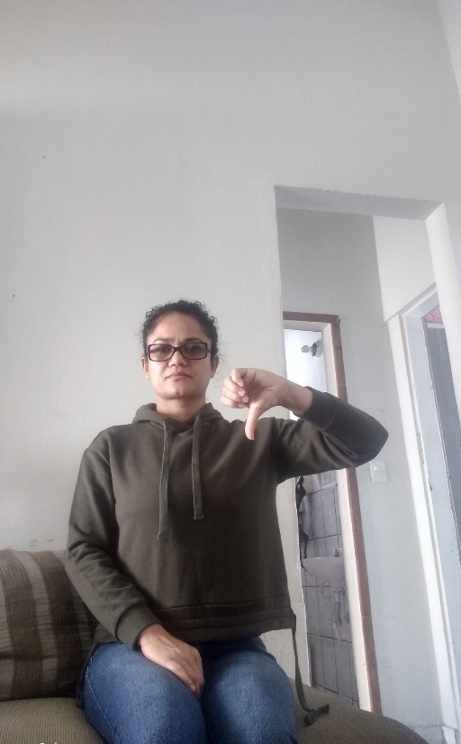 | 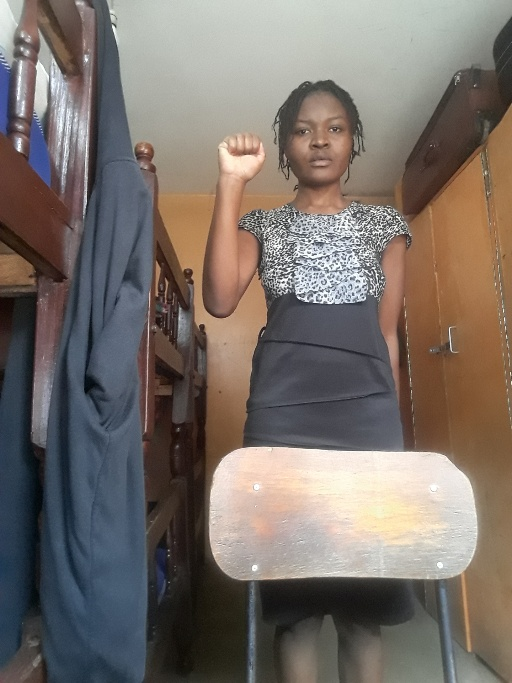 |

| Four | Like | Mute | Ok |
| :---: | :---: | :---: | :---: |
| 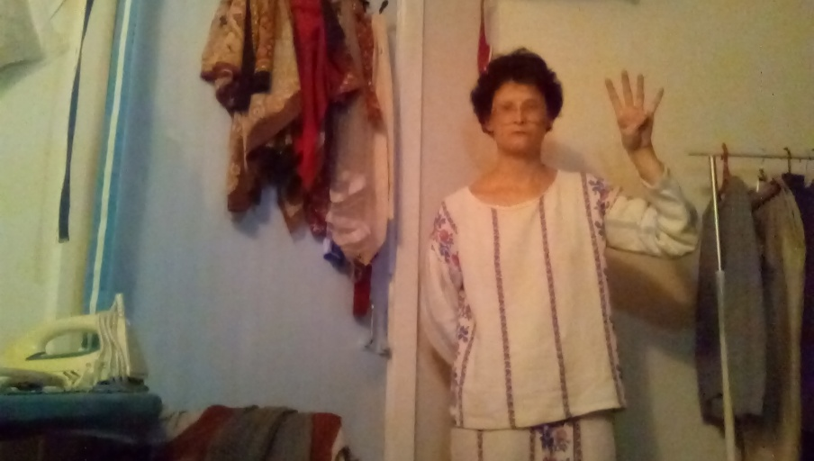 | 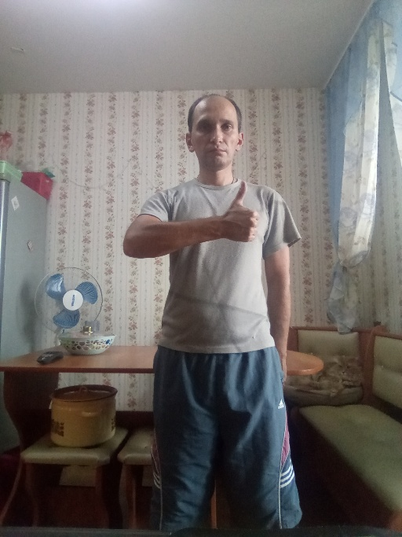 | 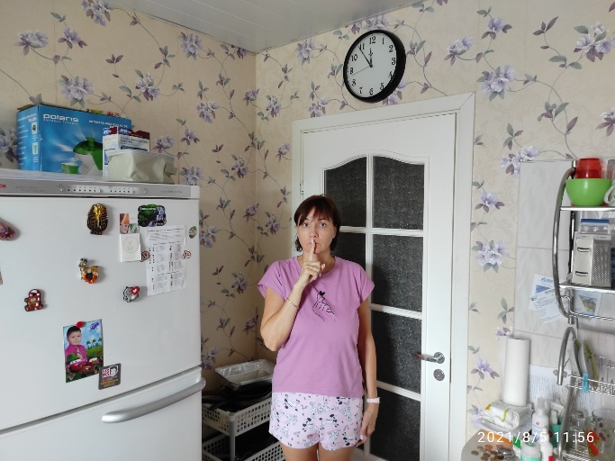 | 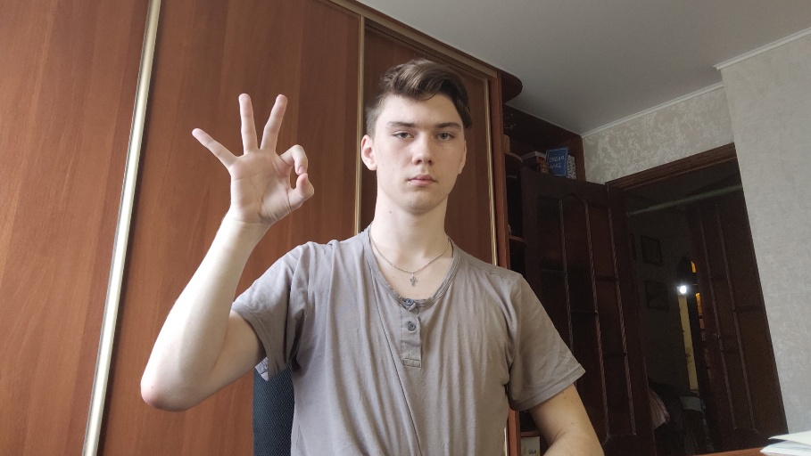 |

| One | Palm | Peace | Peace Inverted |
| :---: | :---: | :---: | :---: |
| 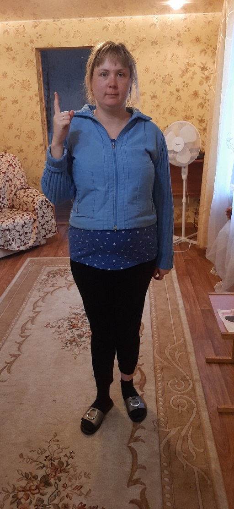 | 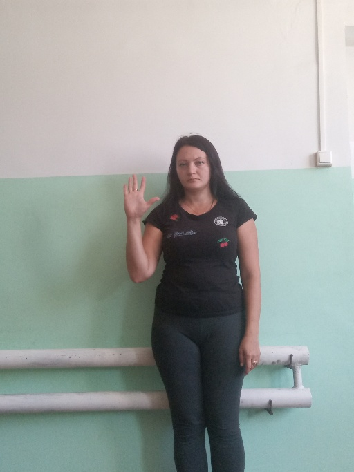 | 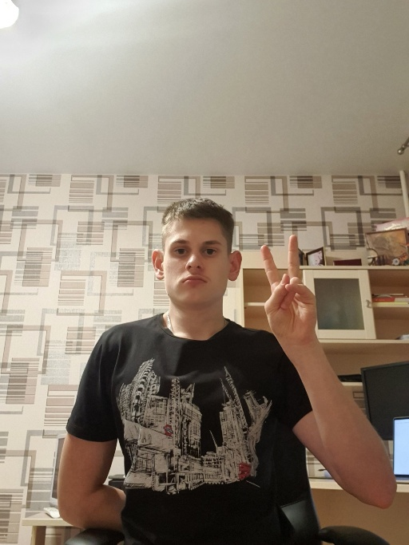 | 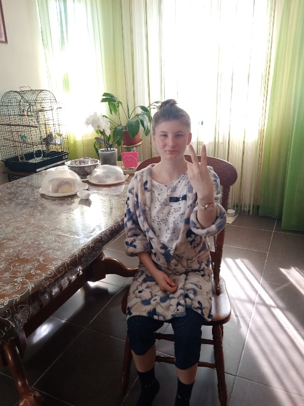 |

| Rock | Stop | Three | Three2 |
| :---: | :---: | :---: | :---: |
| 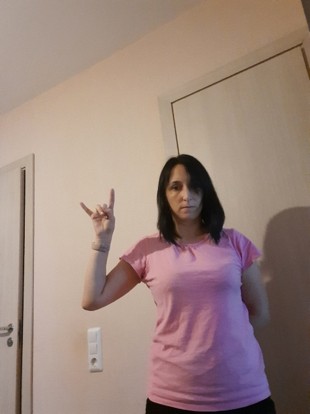 | 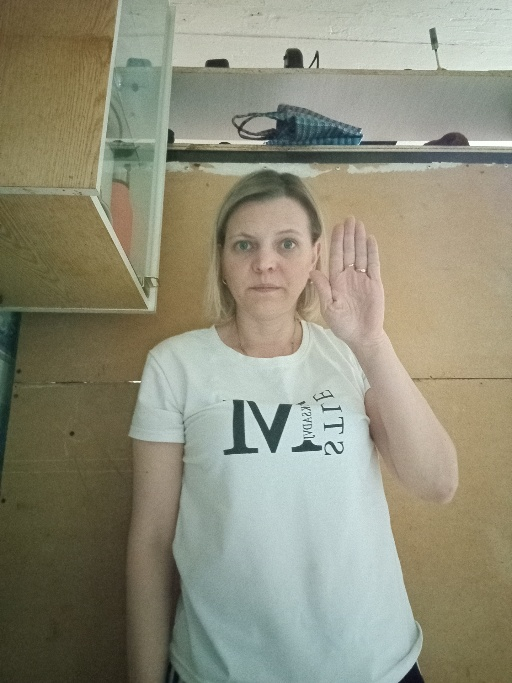 | 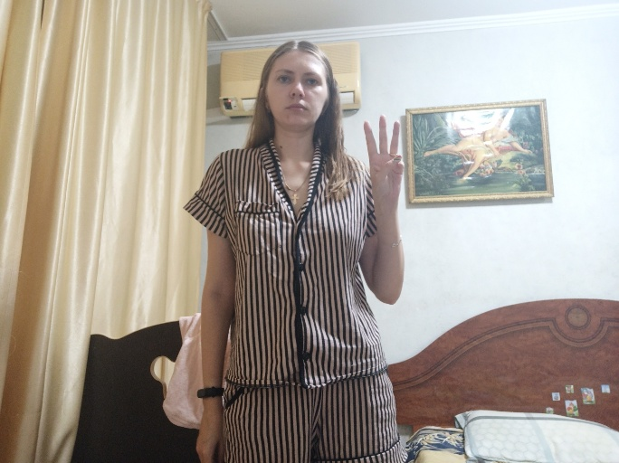 | 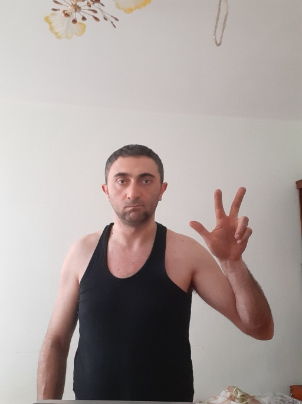 |

| Two Up | Two Up Inverted | No Gesture | |
| :---: | :---: | :---: | :---: |
|  | 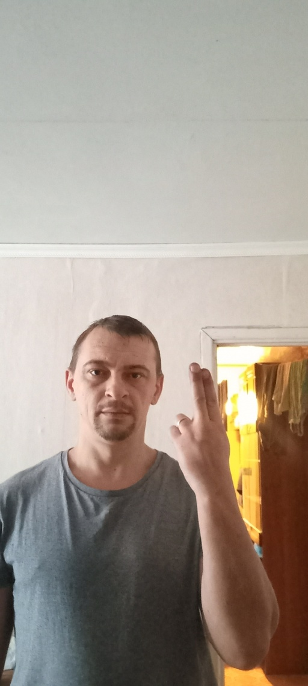 | 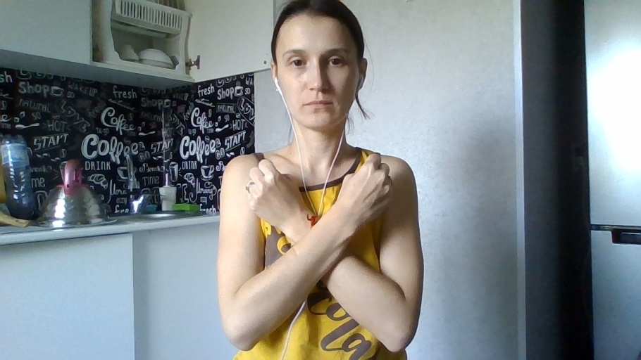 | |

---

## 📂 Project Structure

```text
FaceDetection_System/
├── archive/                   # Raw WIDER FACE dataset (Extracted)
│   ├── WIDER_train/
│   ├── WIDER_val/
│   └── wider_face_annotations/
├── runs/                      # Training logs, graphs, and weights generated by YOLO
├── test.py                    # MAIN SCRIPT: Handles data conversion and model training
├── running.py                 # CAMERA SCRIPT: Runs the live detection system (Face + Gestures)
├── examples/                  # Example images for README
├── rebuild_labels.py          # UTILITY: Fixes label generation if 'Instances: 0' error occurs
├── final_face_model.pt        # The final trained model file (Output)
├── wider_face_config.yaml     # Dataset configuration file (Auto-generated)
└── README.md                  # Project documentation
```

⚙️ Prerequisites & Installation
1. System Requirements
OS: Windows 10/11

Python: Version 3.10 or 3.11 (Required for PyTorch stability)

GPU: NVIDIA RTX/GTX Series (Highly Recommended for training)

2. Environment Setup (Conda)
It is recommended to use Anaconda to manage the Python environment.

Bash

# 1. Open Anaconda Prompt
# 2. Create a clean environment
conda create -n face_system python=3.11 -y

# 3. Activate the environment
conda activate face_system
3. Install Dependencies
Install the required libraries. Note the specific command for GPU support.

Bash

# 1. Install PyTorch with CUDA 12.1 support (For NVIDIA GPUs)
pip install torch torchvision torchaudio --index-url [https://download.pytorch.org/whl/cu121](https://download.pytorch.org/whl/cu121)

# 2. Install general dependencies
pip install opencv-python ultralytics pyyaml
🚀 Phase 1: Training the Model
The test.py script handles the entire training pipeline.

Steps:

Download the WIDER FACE dataset and extract it into the archive folder.

Run the training script:

Bash

python test.py
What this script does:

System Check: Verifies if the GPU (RTX 4060) is available.

Data Conversion: Reads WIDER FACE annotations and converts them to .txt files in YOLO format.

Configuration: Auto-generates wider_face_config.yaml.

Training: Fine-tunes the yolov8n.pt base model for 10 epochs (default).

Saving: Automatically saves the best performing model as final_face_model.pt in the project root.

📷 Phase 2: Running the Camera System
Once training is complete and final_face_model.pt is generated, you can start the live detection.

Command:

Bash

python running.py
Usage:

A window titled "Outstanding Koders - Face Detection" will open.

The system will draw green bounding boxes around detected faces with confidence scores.

To Quit: Press Q on your keyboard.

🛠️ Troubleshooting Guide
1. Error: "WinError 1114" or DLL Load Failed
Cause: Missing system libraries or Intel OpenMP conflict.

Fix: The code includes os.environ["KMP_DUPLICATE_LIB_OK"] = "TRUE". If this persists, reinstall the Microsoft Visual C++ Redistributable.

2. Training shows "Instances: 0"
Cause: The model cannot find the label files (.txt) corresponding to the images.

Fix: Run the rebuild utility to force-generate labels:

Bash

python rebuild_labels.py
3. "CUDA not available" / Training is slow
Cause: PyTorch is using the CPU instead of the GPU.

Fix: Verify installation by running:

Python

import torch
print(torch.cuda.is_available())
If False, reinstall PyTorch using the --index-url command listed in the Installation section.

📝 Credits
Project By: Outstanding Koders

Base Model: Ultralytics YOLOv8

Dataset: WIDER FACE (Yang et al.)

Model file name : final_face_model.pt